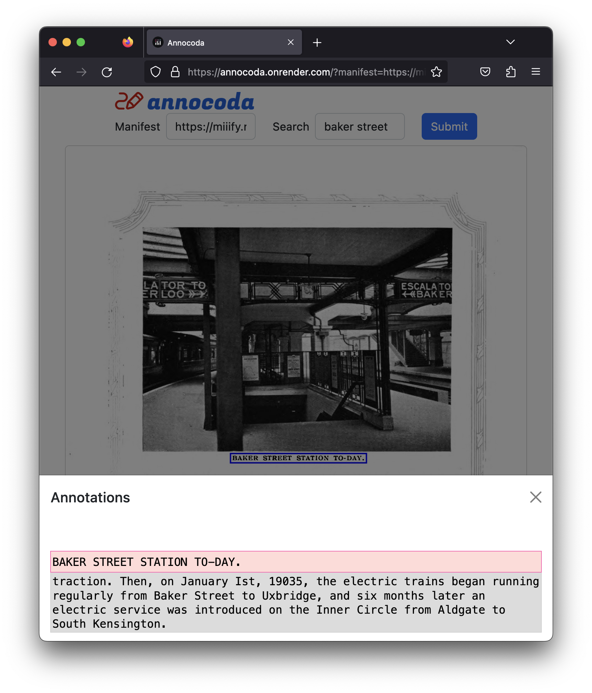

## Introduction

Annocoda is a mobile-friendly web app that uses [IIIF](https://iiif.io/) standards to provide image search capabilities. 

More explicitly it uses the [IIIF Content Search 2.0 API](https://iiif.io/api/search/2.0/) to match [web annotations](https://www.w3.org/TR/annotation-model/) with their corresponding images described within a [Presentation API 3.0](https://iiif.io/api/presentation/3.0/) manifest or collection.

## Example

The result from a search is a carousel of images you can swipe through. By viewing the annotations associated with the image you can see how the image was found. You can also select the text from individual annotations to see where in the image they reference if a fragment selector was included.

## Demo

[https://annocoda.onrender.com](https://annocoda.onrender.com/)

## Requirements

To be able to search a manifest it must [reference a search service](https://iiif.io/api/search/2.0/#3-declaring-services) at its top-level. To see an example of this take a look at this [manifest](https://miiify.rocks/manifest/diamond_jubilee_of_the_metro).

If you want to experiment with your own search service you can try [annotass](https://github.com/jptmoore/annotass).

## Status

Please raise GitHub issues for bugs or feature requests to help support the work.